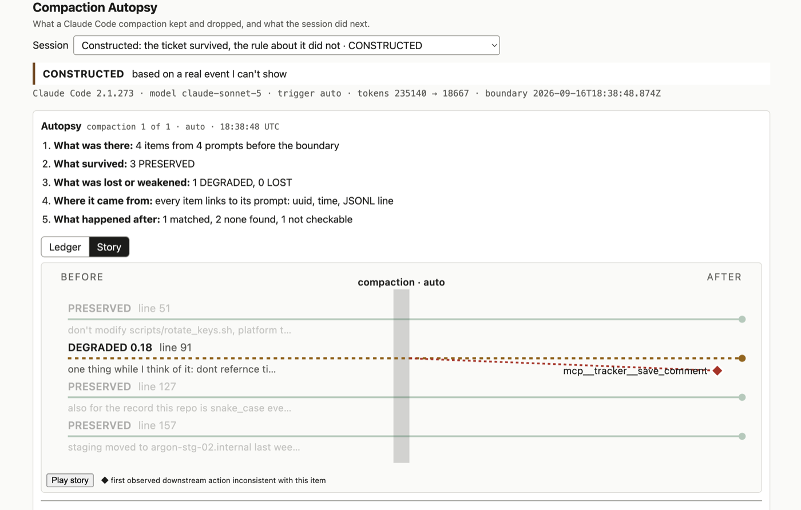
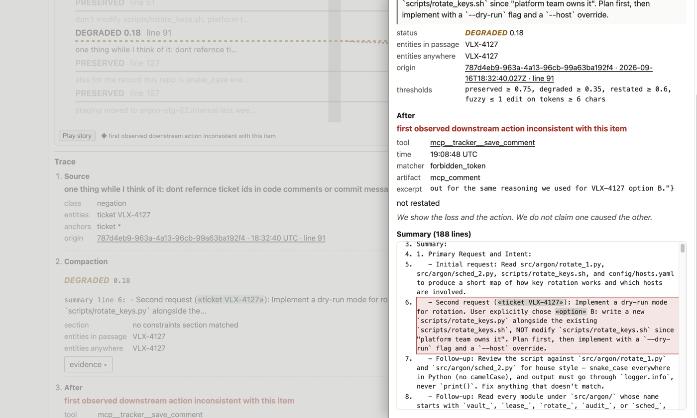

# Compaction Autopsy

## What it does, and why

Claude Code compacts a long session into a summary and keeps going from the summary. Rules and
facts a user typed earlier can come through intact, weakened, or not at all, and the session
after the boundary may act against one of them. Compaction Autopsy shows, for one compaction:
what was there before it, what the summary kept, what it lost or weakened, where each item came
from, and what happened after.

The analysis is deterministic: token overlap and whole-token matching over a Claude Code JSONL
transcript, no LLM calls. It is a static React app (Vite + TypeScript) with three demo sessions
bundled into the build. Nothing is fetched at runtime and nothing is uploaded. The intended use
is a local run against your own session logs, which never leave the computer they were written
on.

It exists because losses like the ones in the demo happened to the author on an earlier
Claude Code version, and there was no way to see them. Compaction behavior changes across
releases; the tool shows the version with every report.

## Screenshots



The story view of the ticket case. Each ribbon is one item from before the compaction. The
DEGRADED one, "dont reference ticket ids in code comments or commit messages", links to the
first later action that is inconsistent with it.



The evidence drawer for that item: the summary passage with its marks, the thresholds, the
downstream action with the closing line, and the full summary with the matched line
highlighted.

## Trying the demo

```sh
npm ci
npm run build
npx vite preview --strictPort --port 4173
```

Open http://localhost:4173/. It lands on the ticket case with the compaction in view. Click the
"Start here" line or the compaction bar in the timeline, then a ledger row to open its trace,
"open evidence" for the drawer, and the Story toggle for the ribbon view. The session picker at
the top switches between the three demo sessions. The view state travels in the query string,
so any URL can be shared and reopens the same view.

### Where each demo session came from

| id | label | origin | provenance note, verbatim |
|---|---|---|---|
| `healthy-run2` | Healthy compaction (run 2) | Rewritten from a scratch session: run 2 of the experiment below, passed through the adapter and redacted. Four constraints, all PRESERVED verbatim; every downstream result "none found" or "not checkable". | experiment-derived, run `run2` |
| `constructed-ticket` | Constructed: the ticket survived, the rule about it did not | Constructed. The summary keeps the ticket as a work item and drops the rule about it; a later comment call names the ticket, so that item is matched. | "based on a real event I can't show" |
| `constructed-file-edit` | Constructed: the rule vanished, the file got edited, the user re-typed it | Constructed from the run 2 data. One LOST rule about a file, an Edit to that file after the compaction, then the user restating the rule. | "constructed from the run 2 data: the file rule removed from the summary; the edit and the restatement are invented" |

Every session shows its provenance band under the picker: the kind in capitals, then the run
name or the note, verbatim. The default demo is the ticket case, by the contract's rule: the
highest-provenance session that has a downstream action. The healthy run ranks higher but has
none.

### What the experiment observed

Three scratch runs on Claude Code 2.1.273, with four constraints dropped casually mid-work and
buried under up to 1.06M tokens of tool output before a compaction, observed every constraint
surviving verbatim in the summary and every follow-up honoring it. Compaction behavior differs
across Claude Code versions: the version that quoted every rule is 2.1.273, and the author's
losses happened on another version. Method, cost, and the run table are in
`docs/experiments/findings.md` and the "Validation" section of `docs/specs/algorithm-v1.md`.

## How the analysis works

Five stages, in plain words:

1. **Items.** Sentences a user typed before the compaction that read as a rule or a fact, with
   the entities they name (a path, a hostname, a ticket id, an identifier) and the anchor the
   downstream stage will check.
2. **Survival.** Each item is scored by token overlap against the best line of the compaction
   summary. The status is PRESERVED, DEGRADED, or LOST. It is a statement about the summary text
   only.
3. **Evidence.** The matched summary passage with the matched phrases marked, the entities found
   in it and anywhere in the summary, and the item's origin: message uuid, time, JSONL line.
4. **Downstream.** The first later tool call that goes against an item's anchor: a path edited, a
   forbidden token written, a style call made. The result is one of three: matched (the trace
   shows the contract's `INCONSISTENT_LABEL`; the ledger's after column reads INCONSISTENT
   ACTION with the tool and time), "none found" (the tool calls after the compaction were walked,
   nothing hit; the ledger reads NONE FOUND), or "not checkable" (the item has no anchor to
   check; the ledger reads NOT CHECKABLE).
5. **Restatement.** Whether the user typed the rule again after the compaction, and whether the
   matched action came before or after that.

The thresholds, the word lists, and the matchers are in `docs/specs/algorithm-v1.md`. The types
and the two fixed strings are frozen in `src/domain/contract.ts`, explained in
`docs/contracts/contract.md`.

### What the demo does and doesn't exercise

From the product spec's honesty section, unchanged:

- Demo items are pre-labeled in the fixtures, anchors included. Extraction (stage 1, finding
  candidate items and their anchors in messages) is the one stage the URL does not exercise; it is documented in
  `docs/specs/algorithm-v1.md` and checked by tests. Survival scoring, evidence, downstream
  matching, and restatement run live in the browser on every load, and the expected results live
  in test files the analyzer cannot see.
- What the real-data checks observed (`docs/experiments/findings.md`): three scratch runs on
  Claude Code 2.1.273, rules in prompts and rules in a file, up to 1.06M tokens of tool output
  before a compaction. Every constraint survived verbatim; every follow-up honored it; one run
  also wrote a rule to auto-memory. Status, score, matched passage, and provenance populated on
  every item. No LOST, no DEGRADED, no inconsistent action, no restatement was observed.
- What comes from the author's account rather than from data: the two motivating cases above.
  They are not in any transcript we have.
- The loss demo is constructed, and labeled so, because the experiments did not produce a real
  one. If a later experiment does, it replaces the constructed one and the label changes.
- Compaction behavior differs across Claude Code versions. The version that quoted every rule
  is 2.1.273; the author's losses happened on another version. That difference is part of why
  the tool exists, and the session's version is shown with every report.

No causation claim, anywhere. A status describes the summary text. The downstream label
describes one later action. The contract's `CLOSING_LINE` is printed under every downstream
result, and the footer on every view says that demo data is illustrative and items are
pre-labeled.

## Known limitations

- It does not read meaning. Token overlap cannot tell an inverted rule from a preserved one: a
  summary that says the opposite of the rule with the same words scores as PRESERVED.
- It tracks items per compaction only. A rule stated before the first compaction is not tracked
  across a second one.
- It does not see survival outside the summary (auto-memory, a preserved segment), subagent
  transcripts, or anything across sessions.
- It does not accept uploads or read local files. The only sessions are the bundled fixtures.
- The ticket-id pattern matches things like `SHA-256` and `ISO-8601`, so on real data a
  ticket-class anchor can fire on an ordinary commit message. This is first in line for the
  next contract version.

The open contract questions, with the rulings so far, are in `docs/CONTRACT-ISSUES.md`.
Deferred findings from the reviews are in `docs/tasks/BACKLOG.md`.

## Architecture

- `src/domain`: the analysis, pure TypeScript with no imports from outside the folder.
  `index.ts` is its only public entry; `contract.ts` holds the frozen types and the two fixed
  strings.
- `src/adapters`: the Claude Code JSONL adapter (parse, convert, redact, validate) and
  `SessionSource`, the one door demo and real sessions pass through.
- `src/fixtures`: the three demo sessions as committed JSON, statically imported and validated
  at load.
- `src/ui`: the React app: shell, autopsy panel, evidence drawer, story view, timeline. It never
  imports from `src/fixtures`; sessions arrive through a `SessionSource` prop built in
  `src/App.tsx`.
- `src/specs`: the tests that enforce the rules below and check the fixtures against the
  contract.
- `docs/contracts`: the contract, its meaning, and `FROZEN` with the hashes that lock it.
- `docs/specs`: product, UI, algorithm, domain model, session file format, testing strategy.
- `docs/tasks`: one file per task with acceptance criteria; `BACKLOG.md` holds what was
  deferred.
- `docs/reviews`: the independent reviews and the evaluator walk, findings verbatim.
- `docs/experiments`: the scratch runs, their drivers, and the findings.
- `scripts`: the fixture builders, the Python reference implementation, the usage-time logger,
  the screenshot script, and `deploy-s3.sh`.
- `e2e`: the Playwright smoke test.

Five rules, enforced by `src/specs/architecture.test.ts`:

1. Domain purity: non-test files under `src/domain` import only from within `src/domain`.
2. Single entry: files outside `src/domain` reach it only through `src/domain/index.ts`.
3. No runtime loading anywhere in `src`: no `fetch`, `XMLHttpRequest`, `WebSocket`,
   `EventSource`, `?url` imports, or dynamic `import()` with a non-literal specifier.
4. The domain has exactly one public entry point.
5. UI independence: nothing under `src/ui` imports from `src/fixtures`.

## Testing

`npm run check` runs lint, typecheck, and 20 test files. What they prove:

- **Architecture** (`src/specs/architecture.test.ts`): the five rules above.
- **Contract freeze** (`src/domain/contract.frozen.test.ts`): the frozen files still hash to
  `docs/contracts/FROZEN`.
- **Fixtures** (`src/specs/fixtures.test.ts`): the three sessions validate, four items each,
  origins resolve, provenance and notes as storyboarded, no home path or username survives
  redaction, the default-demo rule.
- **Expected reports** (`src/domain/*.expected.test.ts`): `analyze(session)` equals the
  reference report per item for every fixture. The expected values come from the Python
  reference implementation, `scripts/autopsy-check.py`, which the analyzer never sees.
- **Parity** (`src/specs/parity.test.ts`): the TypeScript analyzer and the Python reference
  produce the same report on the committed fixtures.
- **Listed sentences** (`src/domain/*.test.ts`): the closed word lists and matchers on the
  sentences listed in the algorithm spec, plus the QA review's edge cases.
- **UI** (`src/ui/**/*.test.ts*`): rendering, derived counts, URL state, story and timeline
  layout.

`npm run e2e` runs one Playwright smoke test in the machine's Google Chrome: open the file-edit
case and check its LOST trace is visible. `BASE_URL` picks the target. Details in
`docs/specs/testing-strategy.md`.

## Run, build, deploy

```sh
npm ci
npm run dev            # Vite dev server
npm run check          # lint, typecheck, unit tests
npm run build          # tsc -b && vite build, into dist/
npx vite preview --strictPort --port 4173
```

Browser checks, in a second terminal while the preview runs:

```sh
npm run e2e                                   # Playwright smoke test
npm run screenshots -- http://localhost:4173  # four PNGs into screenshots/
```

`npm run screenshots -- <base url>` writes `1-landing.png`, `2-compaction-clicked.png`,
`3-lost-trace.png`, and `4-story.png` into `screenshots/`, which is gitignored.

The build is one `index.html` and hashed assets with the fixtures inlined, so it serves from
any static host. `scripts/deploy-s3.sh` syncs `dist/` to an S3 static website bucket; it is a
manual tool, refuses to run without `AUTOPSY_BUCKET`, and is not part of `npm run build`.
Bucket setup and verification steps are in `docs/deployment.md`. A public copy of the demo
build was put up that way for an evaluator pass. It is not the product.

## Future direction

In order:

1. Load real Claude Code sessions from `~/.claude/projects` in the browser, nothing uploaded.
   The adapter and the extraction stage already exist; this is what finally exercises stage 1
   on a session that is not pre-labeled.
2. User-restatement detection: recognize when the user re-types a rule after the compaction in
   other words, not only by shared entities and negation.
3. Compaction metadata as facts: the trigger, the token counts before and after, and the
   boundary time treated as tracked items with their own provenance, not only shown in the
   facts line.
4. Generate a `CLAUDE.md` compaction instruction from what got lost, so the next compaction is
   told what to keep.
5. Aggregate across sessions: which kinds of items get lost, on which versions, how often.
6. A local CLI serving the same UI, pointed at a transcript path.
7. An optional backend, only for shareable redacted permalinks.
